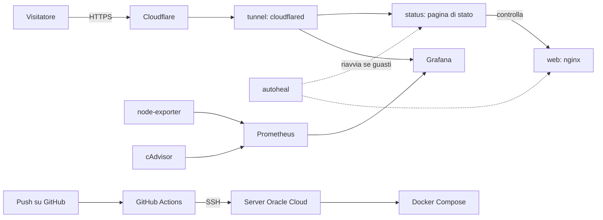

# Axolotl

Un piccolo progetto DevOps che gira su un server Oracle Cloud (Ubuntu, ARM) e che si ripara da solo. Come l'axolotl, che rigenera le zampe perse.

*Demo live:* https://axolotl.speedrace.dpdns.org

Una pagina web mostra lo stato di quattro servizi in tempo reale. Con il pulsante "Simula un guasto" si può provocare un malfunzionamento e guardare il sistema accorgersene e recuperare. Più in basso, nella stessa pagina, una sezione di monitoraggio mostra i grafici del server.

## Cosa fa

- Controlla ogni 30 secondi quattro servizi: il sito Axolotl (nginx in Docker), Google, GitHub e Wikipedia
- Mostra lo stato con un axolotl disegnato in SVG: ogni zampa è un servizio, se uno cade la zampa sparisce e poi ricresce
- Tiene lo storico degli ultimi controlli e calcola la disponibilità (uptime)
- Il pulsante "Simula un guasto" ha un limite di un click al minuto, per non essere abusato
- Mostra grafici in tempo reale del server (CPU, memoria, disco, container) raccolti da Prometheus e disegnati da Grafana
- Ogni modifica caricata su GitHub viene pubblicata sul server in automatico

## Come è fatto

## Monitoraggio

Il server è osservato con uno stack di monitoraggio, definito interamente come codice nella cartella monitoring/:

- *Prometheus* raccoglie le metriche ogni 15 secondi e le conserva per 7 giorni
- *node-exporter* fornisce le metriche del server: CPU, memoria, disco, uptime
- *cAdvisor* fornisce le metriche di ogni container Docker
- *Grafana* disegna i grafici. Datasource e dashboard sono creati automaticamente all'avvio (provisioning): ricreare tutto da zero richiede un solo comando
- I grafici sono incorporati nella pagina Axolotl, con un pulsante per aprire la dashboard completa su un sottodominio dedicato

Nessuno di questi servizi pubblica porte sul server: sono raggiungibili solo dalla rete interna di Docker e, per Grafana, tramite il tunnel Cloudflare.

## Tecnologie

- Docker e Docker Compose
- Healthcheck e riavvio automatico dei container (autoheal)
- Prometheus, node-exporter, cAdvisor e Grafana per il monitoraggio
- Cloudflare Tunnel per pubblicare la pagina in HTTPS senza aprire porte
- GitHub Actions per il deploy automatico via SSH
- Python (solo libreria standard) per la pagina di stato
- Ubuntu 24.04 su Oracle Cloud (ARM)

## Sicurezza

Ho seguito il principio del minimo privilegio: ogni componente ha solo i permessi che gli servono, niente di più.

*Rete*
- La pagina è pubblicata con Cloudflare Tunnel: il server si collega a Cloudflare in uscita, quindi *nessuna porta in entrata è stata aperta* per il sito
- HTTPS gestito da Cloudflare, che fa anche da filtro davanti al server
- La porta della pagina di stato è esposta solo in locale (127.0.0.1), mai su internet
- I servizi di monitoraggio non pubblicano nessuna porta
- Firewall di rete Oracle: le porte non necessarie restano chiuse

*Container*
- Il container della pagina di stato non gira come root ma come utente senza privilegi
- Disco in sola lettura: chi violasse l'applicazione non potrebbe scrivere né scaricare programmi
- Tutte le capability Linux rimosse e no-new-privileges attivo
- Limiti di memoria, CPU e numero di processi, per evitare che un sovraccarico fermi il resto del server
- Gli stessi criteri valgono per Prometheus e Grafana

*Server*
- Accesso SSH solo con chiave: login con password disattivato, root senza password
- fail2ban attivo: oltre 2000 tentativi di accesso respinti, 148 indirizzi bloccati
- Servizio rpcbind disattivato per ridurre le porte esposte

*Applicazione web*
- Intestazioni di sicurezza: Content-Security-Policy, X-Content-Type-Options, Cache-Control: no-store
- La Content-Security-Policy permette di incorporare in pagina solo il sottodominio di Grafana
- Limite di richieste sul pulsante di simulazione (429 se si preme troppo presto)
- La simulazione agisce solo su un servizio dimostrativo e non può toccare altri container

*Grafana*
- Registrazione di nuovi utenti disattivata
- I visitatori anonimi hanno solo il ruolo di sola lettura (Viewer)
- La password dell'amministratore sta nel file .env sul server, mai nel repository

*Segreti e deploy*
- Il token del tunnel sta in un file .env fuori dal repository (.gitignore) e l'ho rigenerato dopo averlo usato
- Il deploy usa una chiave SSH salvata nei segreti di GitHub, mai nel repository
- I token GitHub hanno solo i permessi necessari

*Prossimi passi*
- Chiave di deploy dedicata con permessi limitati e rotazione periodica
- Protezione con Cloudflare Access sulla pagina di login di Grafana
- Statistiche degli attacchi bloccati da fail2ban

## Problemi incontrati e risolti

- *Il deploy falliva* perché autoheal riavviava il container proprio mentre Docker lo sostituiva. Soluzione: nel deploy si rimuove prima il container, poi lo si ricrea
- *Il controllo di salute non funzionava* perché localhost veniva risolto in IPv6 e il servizio ascoltava solo in IPv4. Soluzione: usare 127.0.0.1
- *Il push veniva rifiutato* perché il token GitHub non aveva il permesso workflow. Soluzione: nuovo token con i permessi giusti
- *Il tunnel non si poteva installare come servizio* perché sul server ce n'era già uno per un altro progetto. Soluzione: farlo girare come container Docker dentro il progetto, senza toccare quello esistente
- *I grafici mostravano dati finti* perché nei pannelli mancava il datasource e Grafana usava quello di prova. Soluzione: datasource con identificativo fisso, indicato in ogni pannello
- *I pannelli restavano in errore* perché il container di Grafana è in sola lettura e non poteva installare i suoi plugin. Soluzione: disattivare l'installazione automatica dei plugin
- *I titoli dei riquadri finivano sotto la scritta "Powered by Grafana"* sul telefono. Soluzione: titoli più corti

## Limiti noti

- autoheal ha accesso al socket di Docker, che è un accesso potente. In produzione si userebbe un orchestratore o un permesso più ristretto
- cAdvisor e node-exporter leggono il sistema del server (in sola lettura) e cAdvisor non ha tutte le capability rimosse: è il compromesso necessario per leggere le metriche dei container
- L'incorporamento di Grafana richiede di permettere gli iframe, e la scritta "Powered by Grafana" non si può togliere
- Non c'è un grafico di rete: node-exporter gira in un container e vedrebbe solo la rete del container
- Il progetto gira su un singolo server: se cade il server, cade tutto

## Cosa ho imparato

Container, healthcheck, pipeline di deploy automatico, sicurezza di base di un server Linux, tunnel e HTTPS con Cloudflare, monitoraggio con Prometheus e Grafana con dashboard come codice, e come diagnosticare un problema leggendo i log.
